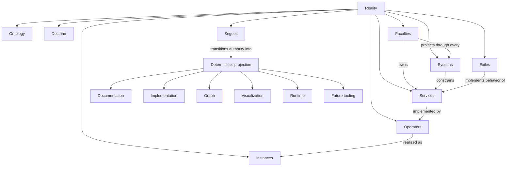
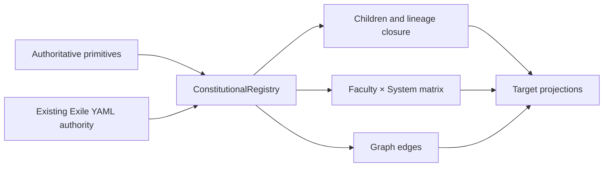

# Constitutional projection architecture

```mermaid
flowchart TD
  R[Reality]
  R --> O[Ontology]
  R --> D[Doctrine]
  R --> SY[Systems]
  R --> E[Exiles]
  R --> F[Faculties]
  R --> S[Services]
  R --> OP[Operators]
  R --> I[Instances]
  R --> SG[Segues]

  F -->|projects through every| SY
  F -->|owns| S
  SY -->|constrains| S
  E -->|implements behavior of| S
  S -->|implemented by| OP
  OP -->|realized as| I
  SG -->|transitions authority into| P[Deterministic projection]
  P --> DOC[Documentation]
  P --> IMP[Implementation]
  P --> G[Graph]
  P --> V[Visualization]
  P --> RT[Runtime]
  P --> FT[Future tooling]
```

```mermaid
flowchart LR
  A[Authoritative primitives] --> C[ConstitutionalRegistry]
  X[Existing Exile YAML authority] --> C
  C --> CH[Children and lineage closure]
  C --> MX[Faculty × System matrix]
  C --> GE[Graph edges]
  CH --> T[Target projections]
  MX --> T
  GE --> T
```

Only the two left-hand authority inputs are stored. Every node to their right is regenerated deterministically.
